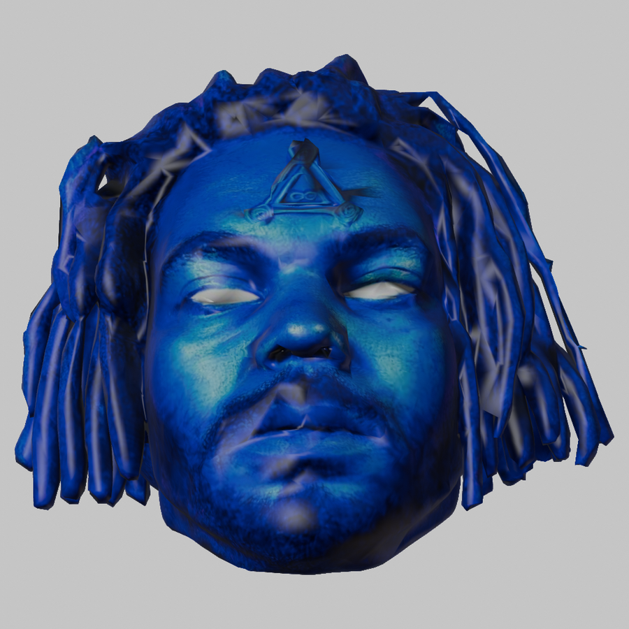
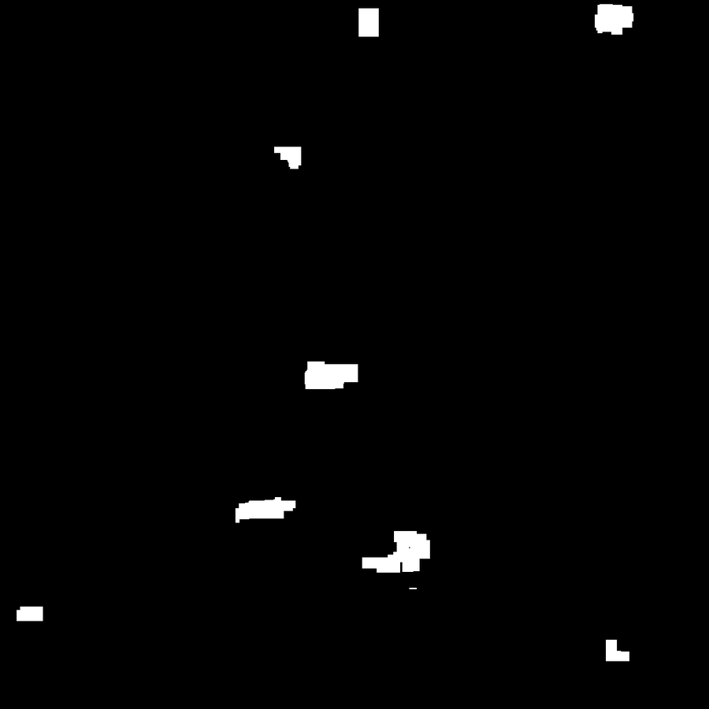

# Evidence — linework

Rendered frames and the measurements that produced them, committed so that
**every agent and every CI runner can see them**, not just the container that
made them. `renders/` stays gitignored; these are downscaled copies with the
source hash recorded, published by `tools/publish_evidence.py`.

| frame | source sha256[:8] | rendered |
|---|---|---|
| `front_ortho.png` | `fe9cb398` | 1024x1024 |
| `sigil_uv_mask.png` | `6f3f0100` | 1024x1024 |

### front ortho

### sigil uv mask

