# Evidence — mouth

Rendered frames and the measurements that produced them, committed so that
**every agent and every CI runner can see them**, not just the container that
made them. `renders/` stays gitignored; these are downscaled copies with the
source hash recorded, published by `tools/publish_evidence.py`.

| frame | source sha256[:8] | rendered |
|---|---|---|
| `01_REST_front.png` | `86058257` | 900x900 |
| `01_REST_mouth.png` | `4627a9b2` | 900x900 |
| `01_REST_profile.png` | `ca7bb3c7` | 900x900 |
| `02_OPEN_front.png` | `97bc5dc8` | 900x900 |
| `02_OPEN_mouth.png` | `2a9066b6` | 900x900 |
| `02_OPEN_profile.png` | `2b8aca66` | 900x900 |
| `03_WIDE_front.png` | `1ec6d55e` | 900x900 |
| `03_WIDE_mouth.png` | `2c005821` | 900x900 |
| `03_WIDE_profile.png` | `37ba6a39` | 900x900 |
| `04_AA_front.png` | `3f72eedd` | 900x900 |
| `04_AA_mouth.png` | `8fc679ad` | 900x900 |
| `04_AA_profile.png` | `dfdc5fe2` | 900x900 |
| `05_OH_front.png` | `e1a2d9d9` | 900x900 |
| `05_OH_mouth.png` | `913b3113` | 900x900 |
| `05_OH_profile.png` | `c158f9d8` | 900x900 |
| `06_EE_front.png` | `a25b901b` | 900x900 |
| `06_EE_mouth.png` | `aa19a949` | 900x900 |
| `06_EE_profile.png` | `68f2df97` | 900x900 |
| `07_MM_front.png` | `f6917b28` | 900x900 |
| `07_MM_mouth.png` | `2cbc4d6f` | 900x900 |
| `07_MM_profile.png` | `40c00db0` | 900x900 |
| `08_FF_front.png` | `4cceb69a` | 900x900 |
| `08_FF_mouth.png` | `49f37a0e` | 900x900 |
| `08_FF_profile.png` | `2634bc5f` | 900x900 |
| `09_BLINK_front.png` | `baef920f` | 900x900 |
| `09_BLINK_mouth.png` | `738407b1` | 900x900 |
| `09_BLINK_profile.png` | `ce866fca` | 900x900 |
| `10_SMILE_front.png` | `eb0d91c7` | 900x900 |
| `10_SMILE_mouth.png` | `fdb31562` | 900x900 |
| `10_SMILE_profile.png` | `0709f966` | 900x900 |

## Measured, per pose

Rays are fired at the mouth and classified by the MATERIAL each one lands on.
Material identity cannot be fooled by a hole in the wrong place; a plane test can.

| pose | jaw | lip gap (% head height) | skin | cavity | teeth | gum | tongue |
|---|---|---|---|---|---|---|---|
| 01_REST | 0° | 0.00% | 99.4 | 0.6 | 0.0 | 0.0 | 0.0 |
| 02_OPEN | 18° | 11.13% | 72.8 | 20.4 | 2.8 | 0.3 | 3.9 |
| 03_WIDE | 31° | 14.84% | 57.0 | 28.3 | 4.8 | 2.1 | 7.8 |
| 04_AA | 23° | 14.29% | 65.5 | 24.5 | 2.8 | 1.3 | 6.0 |
| 05_OH | 15° | 9.89% | 80.9 | 13.2 | 2.2 | 0.5 | 3.2 |
| 06_EE | 6° | 4.67% | 88.5 | 10.3 | 1.2 | 0.0 | 0.0 |
| 07_MM | 0° | 0.00% | 100.0 | 0.0 | 0.0 | 0.0 | 0.0 |
| 08_FF | 5° | 2.88% | 91.8 | 8.0 | 0.2 | 0.0 | 0.0 |
| 09_BLINK | 0° | 0.00% | 99.4 | 0.6 | 0.0 | 0.0 | 0.0 |
| 10_SMILE | 4° | 2.47% | 92.5 | 7.2 | 0.3 | 0.0 | 0.0 |

## Gate

| check | result | detail |
|---|---|---|
| REST reads as a closed mouth | PASS | cavity 0.6% + tongue 0.0% of the mouth area |
| REST shows at most a hint of upper teeth | PASS | teeth 0.0% |
| OPEN parts the lips | PASS | gap 11.13% of head height vs 0.00% at rest |
| WIDE shows real teeth | PASS | teeth 4.8% |
| WIDE shows the tongue | PASS | tongue 7.8% |
| WIDE shows cavity behind them | PASS | cavity 28.3% |
| OH and EE are different mouths | PASS | OH gap 0.0834 vs EE gap 0.0394 |
| MM closes the mouth | PASS | cavity 0.0% |

**Physical gate: PASS** — 8 of 8 checks pass.

**Visual gate: FAIL.** A passing physical gate is not a passing model — these exact numbers went green on a frame whose crowns still read as separate pegs. VISUAL_FAIL outranks the measurements; PENDING is not PASS.

### 01 REST front

### 01 REST mouth

### 01 REST profile

### 02 OPEN front

### 02 OPEN mouth

### 02 OPEN profile

### 03 WIDE front

### 03 WIDE mouth

### 03 WIDE profile

### 04 AA front

### 04 AA mouth

### 04 AA profile

### 05 OH front

### 05 OH mouth

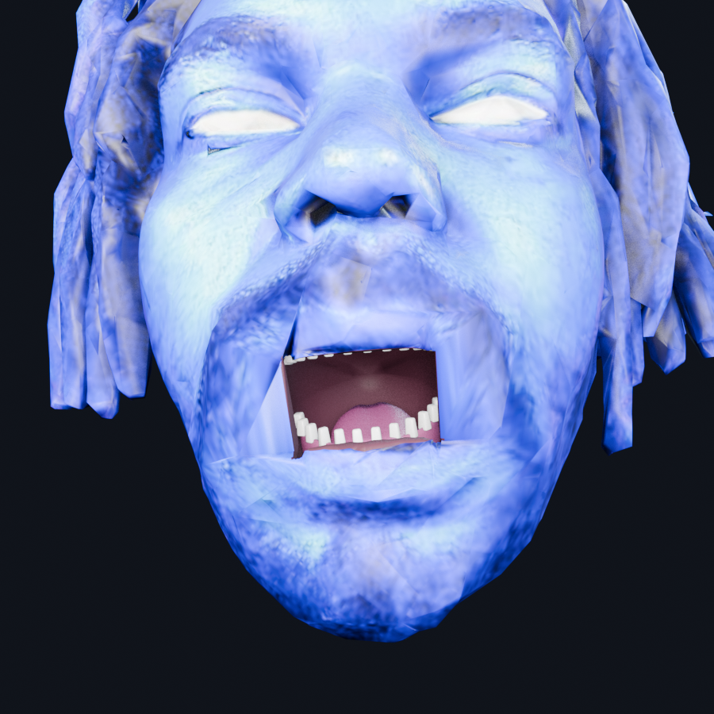

### 05 OH profile

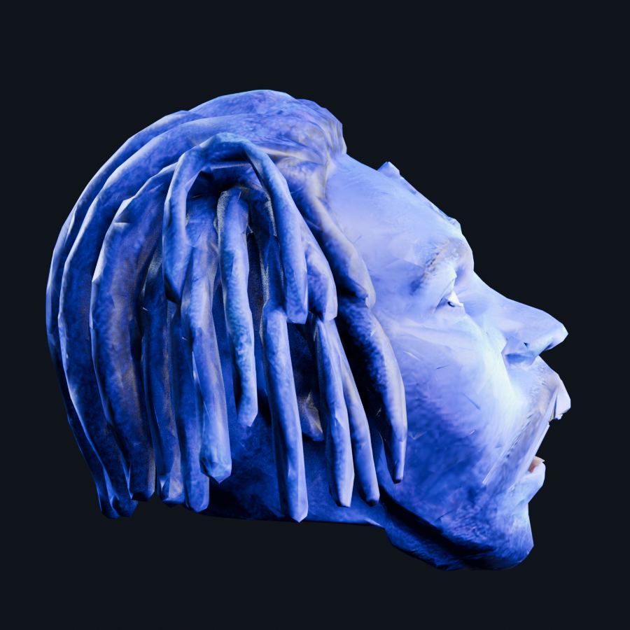

### 06 EE front

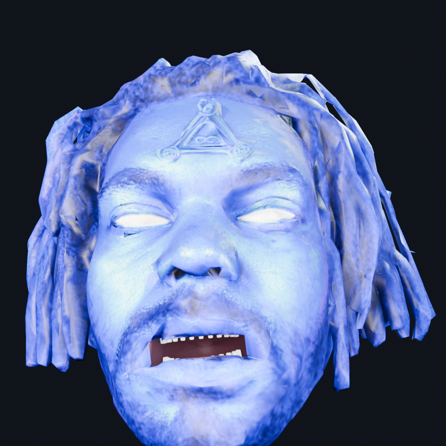

### 06 EE mouth

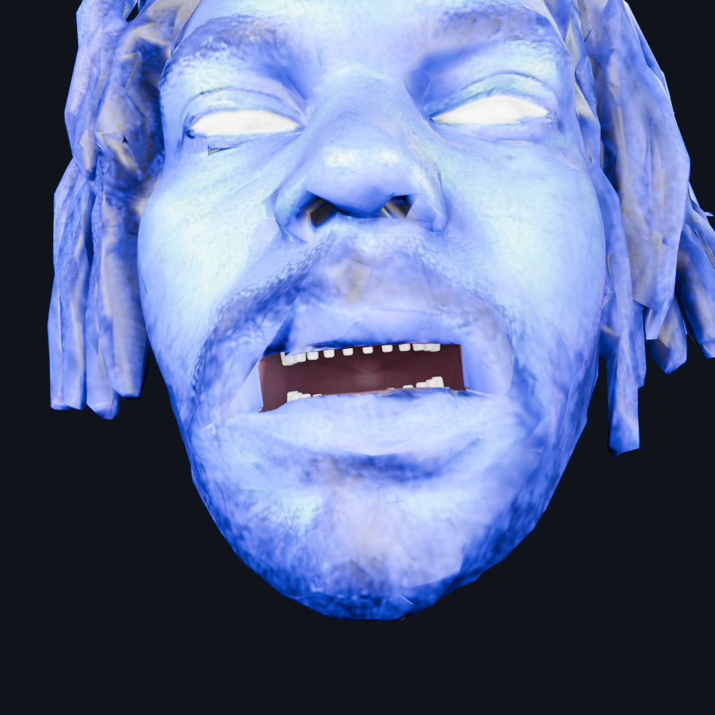

### 06 EE profile

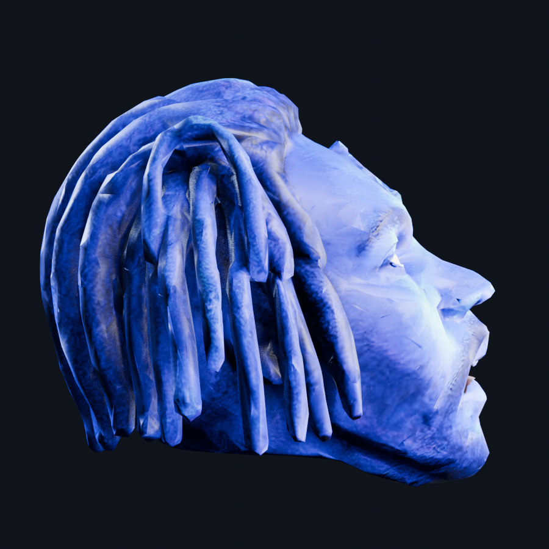

### 07 MM front

### 07 MM mouth

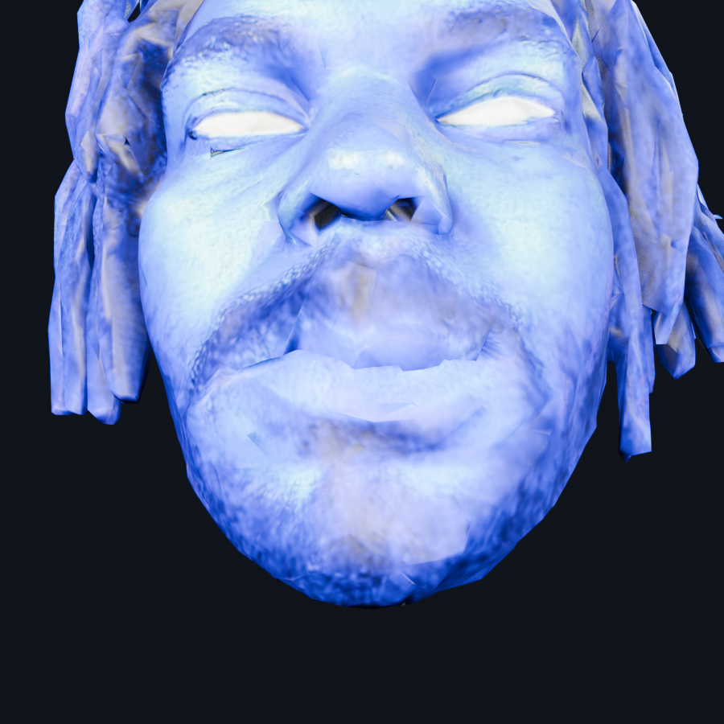

### 07 MM profile

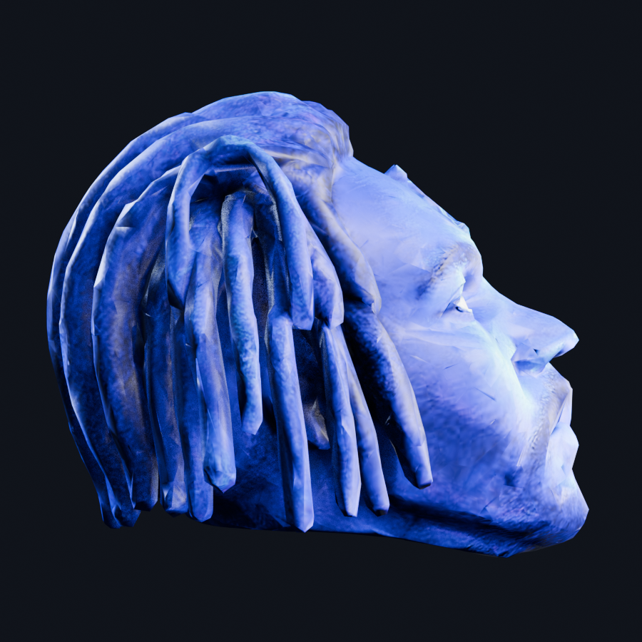

### 08 FF front

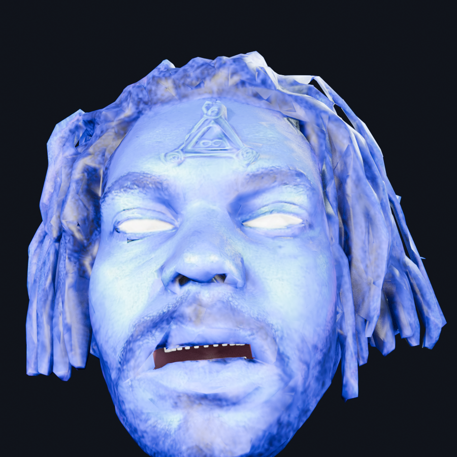

### 08 FF mouth

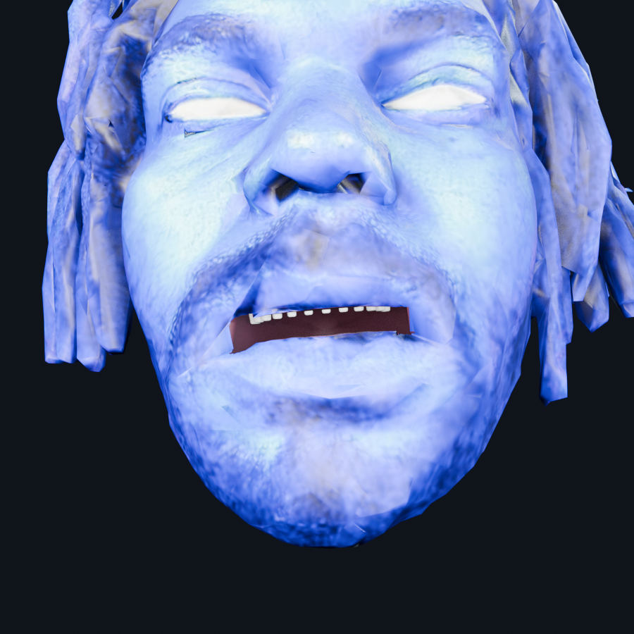

### 08 FF profile

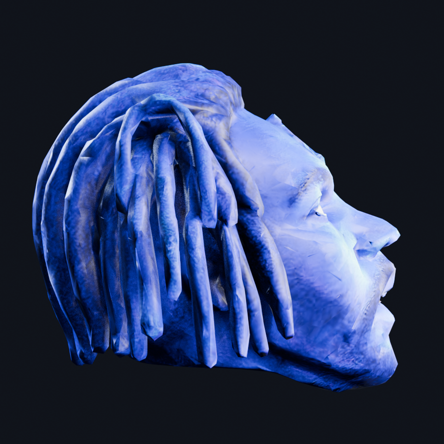

### 09 BLINK front

### 09 BLINK mouth

### 09 BLINK profile

### 10 SMILE front

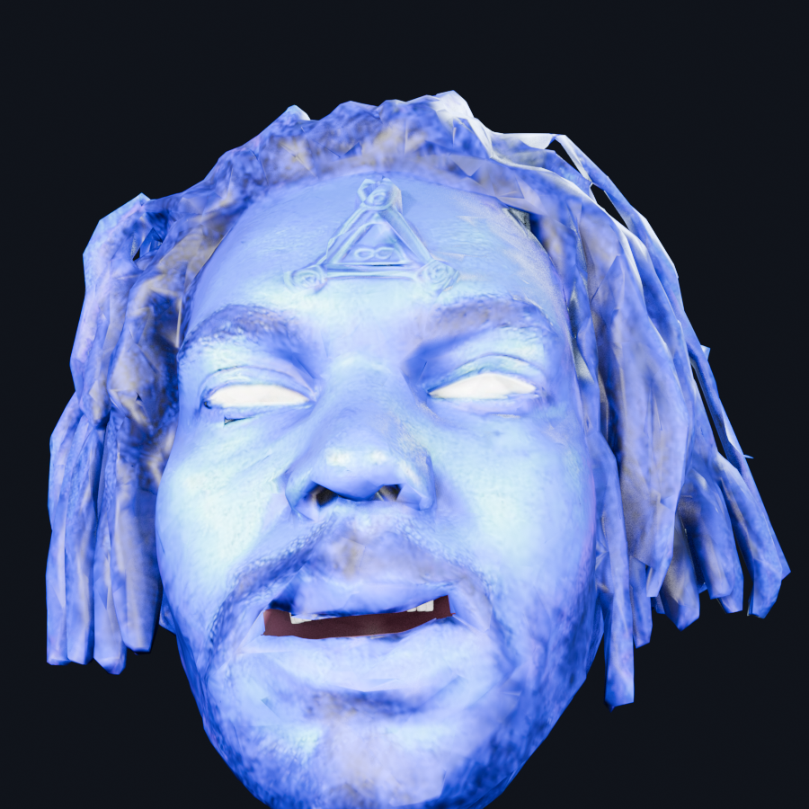

### 10 SMILE mouth

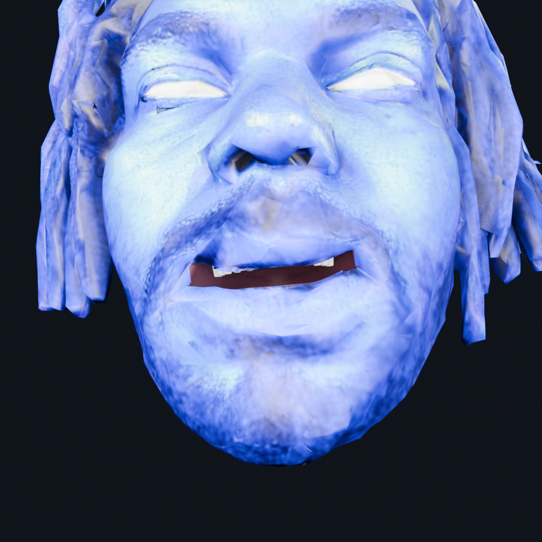

### 10 SMILE profile

