# Evidence — mouth

Rendered frames and the measurements that produced them, committed so that
**every agent and every CI runner can see them**, not just the container that
made them. `renders/` stays gitignored; these are downscaled copies with the
source hash recorded, published by `tools/publish_evidence.py`.

| frame | source sha256[:8] | rendered |
|---|---|---|
| `01_REST_front.png` | `86058257` | 900x900 |
| `01_REST_mouth.png` | `4627a9b2` | 900x900 |
| `01_REST_profile.png` | `ca7bb3c7` | 900x900 |
| `02_OPEN_front.png` | `97bc5dc8` | 900x900 |
| `02_OPEN_mouth.png` | `2a9066b6` | 900x900 |
| `02_OPEN_profile.png` | `2b8aca66` | 900x900 |
| `03_WIDE_front.png` | `9d19949b` | 900x900 |
| `03_WIDE_mouth.png` | `33f30b4a` | 900x900 |
| `03_WIDE_profile.png` | `e61c7c16` | 900x900 |
| `04_AA_front.png` | `3f72eedd` | 900x900 |
| `04_AA_mouth.png` | `8fc679ad` | 900x900 |
| `04_AA_profile.png` | `dfdc5fe2` | 900x900 |
| `05_OH_front.png` | `e1a2d9d9` | 900x900 |

## Measured, per pose

Rays are fired at the mouth and classified by the MATERIAL each one lands on.
Material identity cannot be fooled by a hole in the wrong place; a plane test can.

| pose | jaw | lip gap (% head height) | skin | cavity | teeth | gum | tongue |
|---|---|---|---|---|---|---|---|
| 03_WIDE | 31° | 14.84% | 50.3 | 13.7 | 13.5 | 0.7 | 21.8 |

## Gate

| check | result | detail |
|---|---|---|
| WIDE shows real teeth | PASS | teeth 13.5% |
| WIDE shows the tongue | PASS | tongue 21.8% |
| WIDE shows cavity behind them | PASS | cavity 13.7% |

**Physical gate: PASS** — 3 of 3 checks pass.

**Visual gate: FAIL.** A passing physical gate is not a passing model — these exact numbers went green on a frame whose crowns still read as separate pegs. VISUAL_FAIL outranks the measurements; PENDING is not PASS.

### 01 REST front

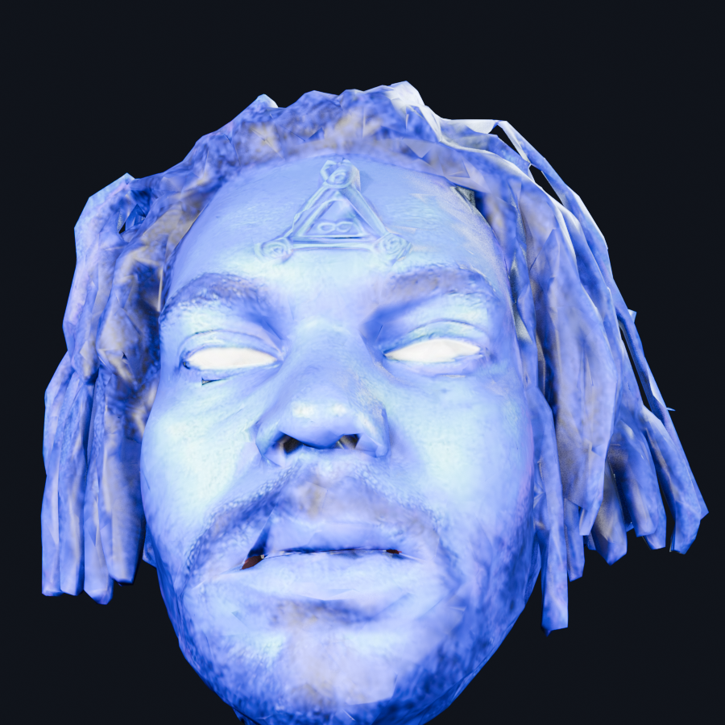

### 01 REST mouth

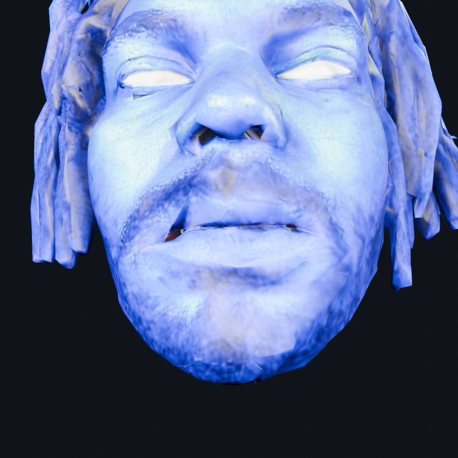

### 01 REST profile

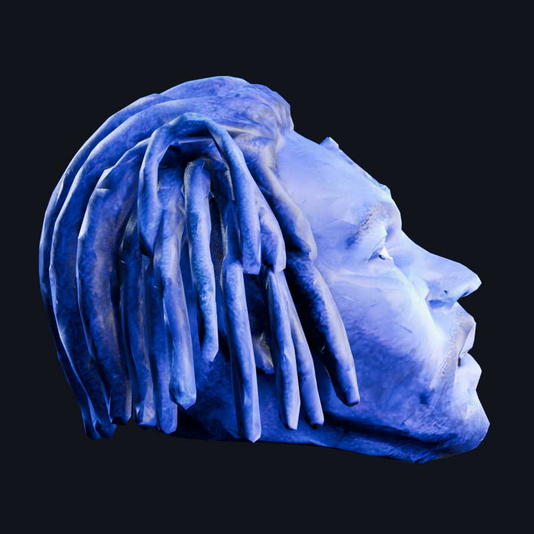

### 02 OPEN front

### 02 OPEN mouth

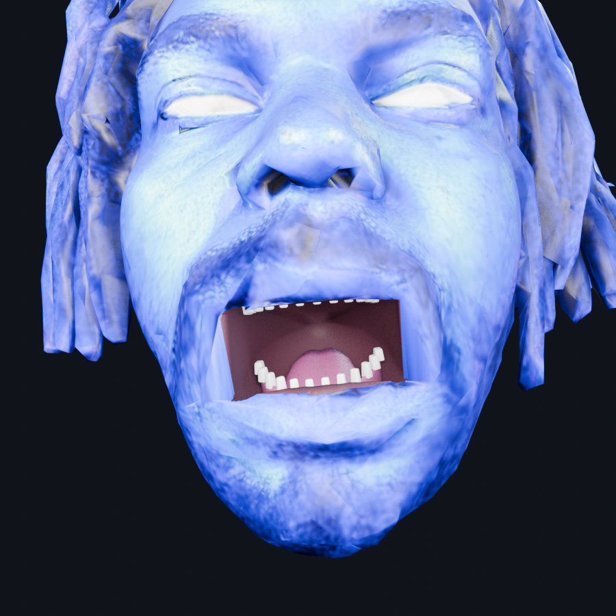

### 02 OPEN profile

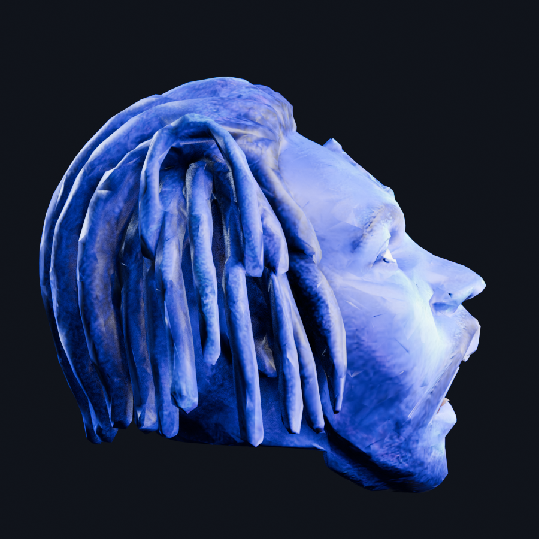

### 03 WIDE front

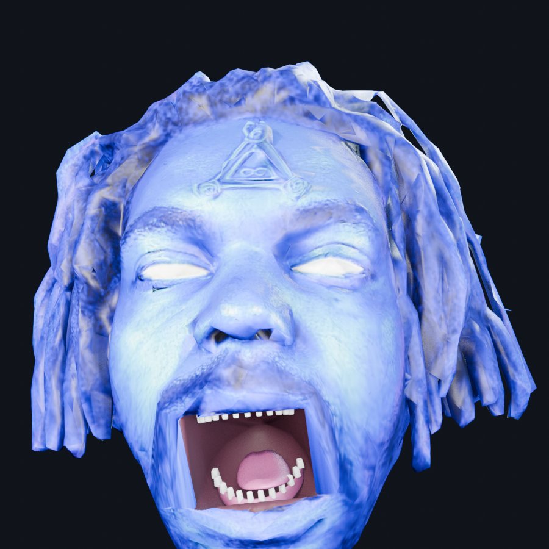

### 03 WIDE mouth

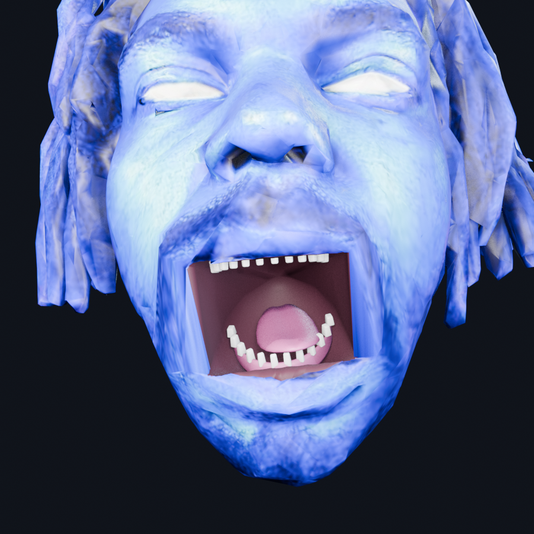

### 03 WIDE profile

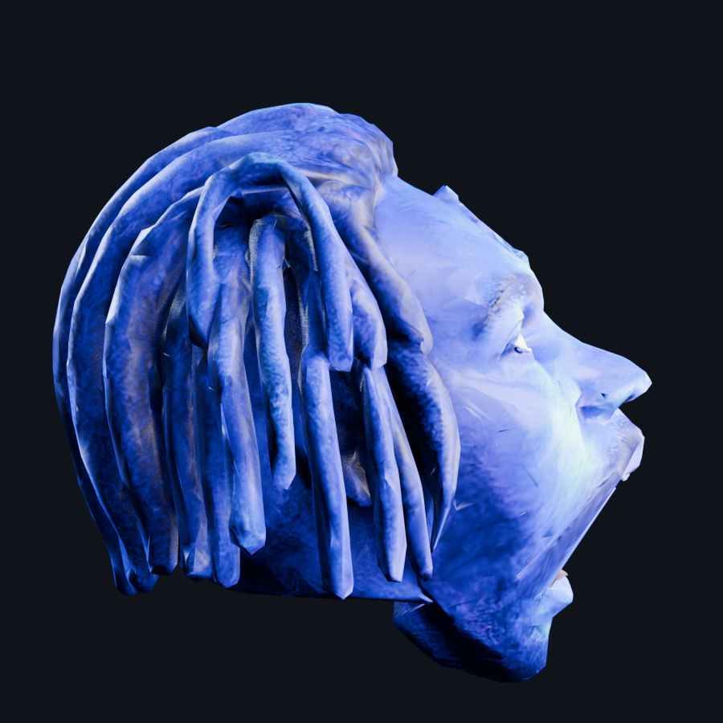

### 04 AA front

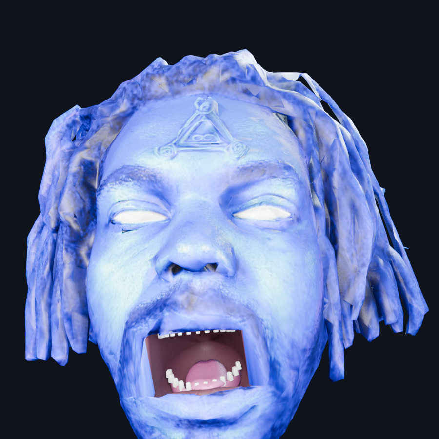

### 04 AA mouth

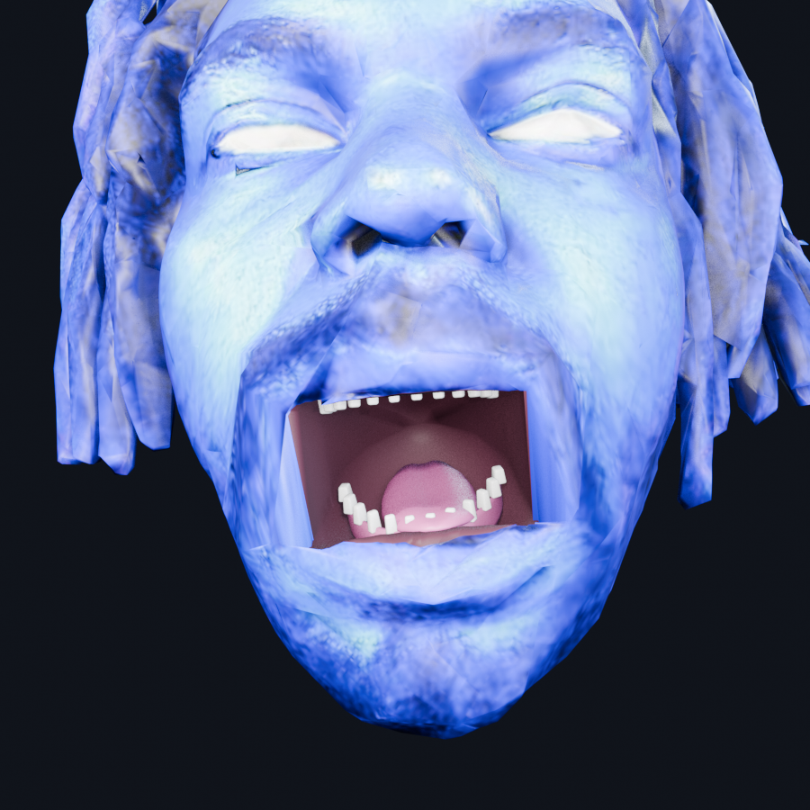

### 04 AA profile

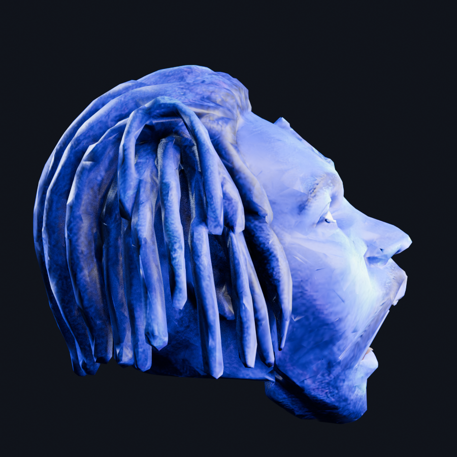

### 05 OH front

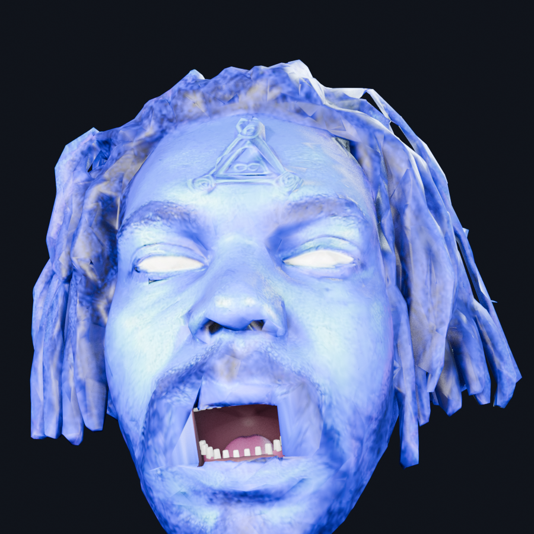

