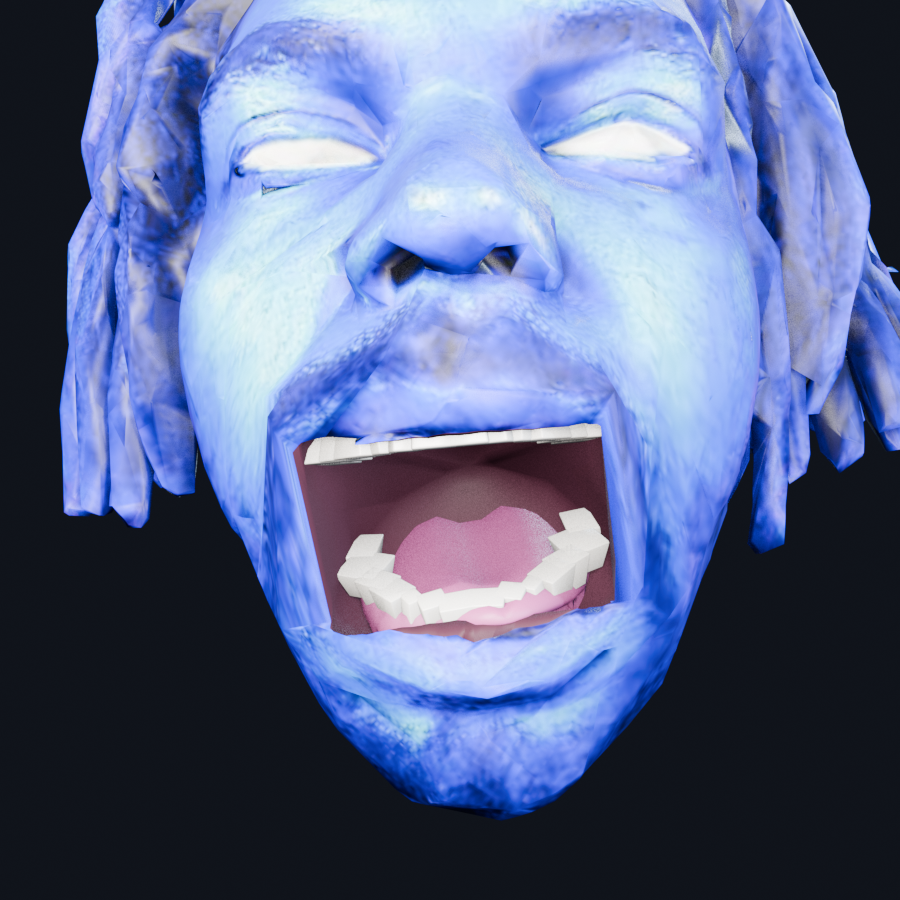
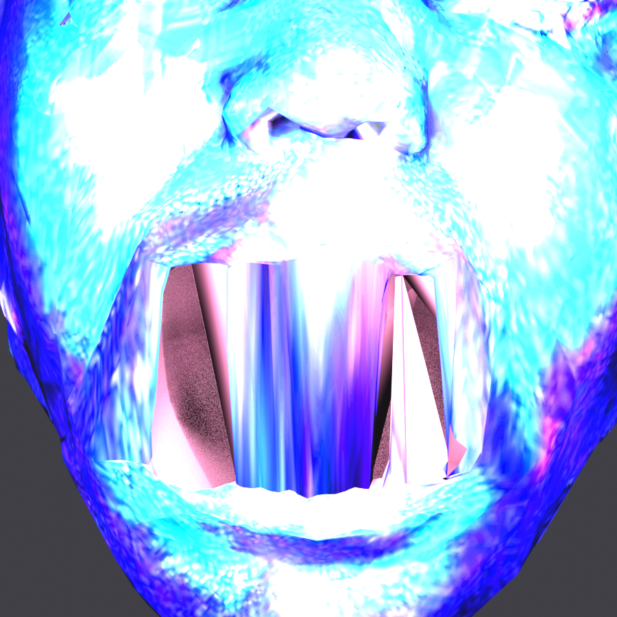
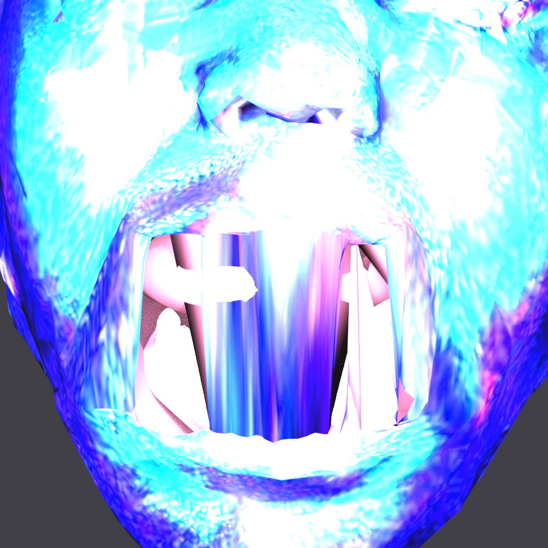
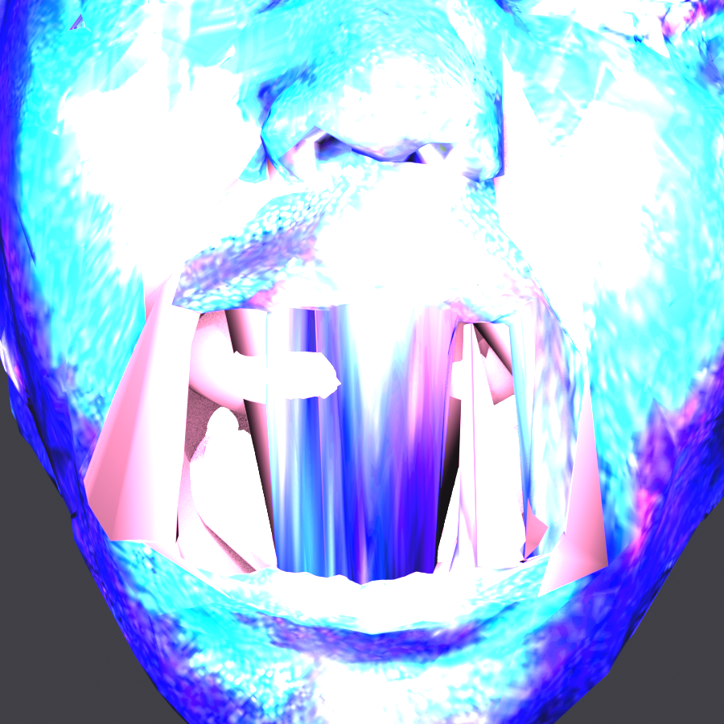
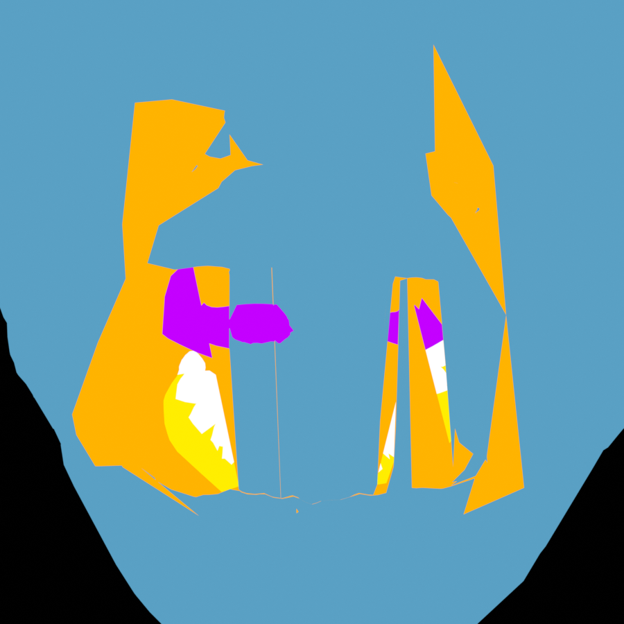
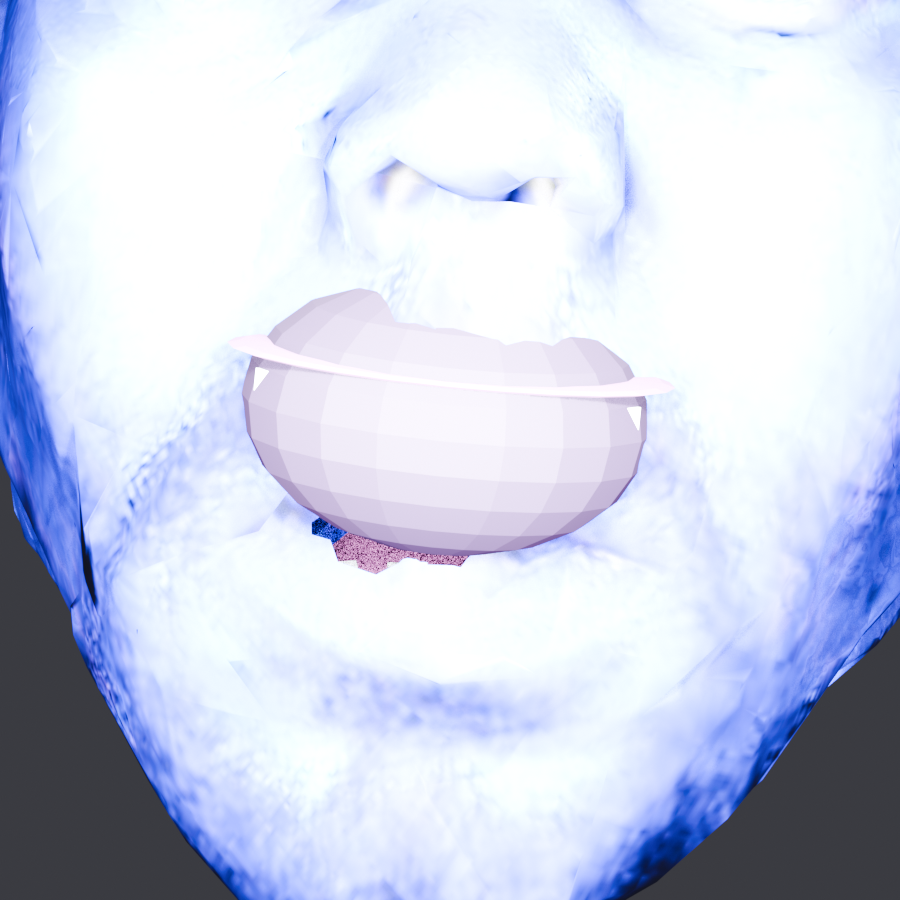
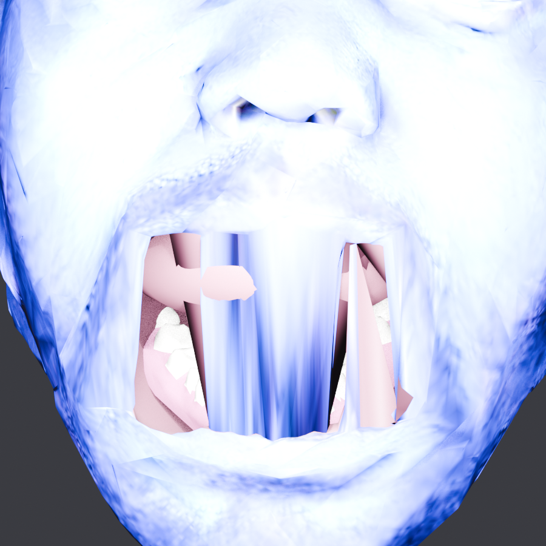
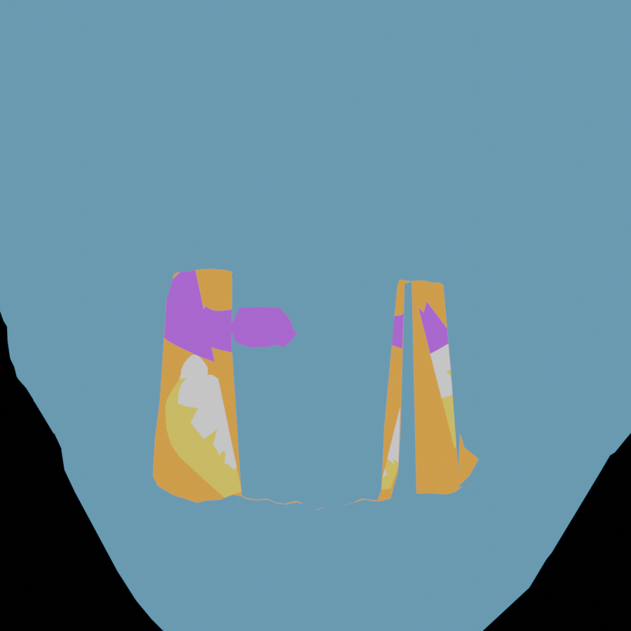

# Evidence — oral_diagnosis

Rendered frames and the measurements that produced them, committed so that
**every agent and every CI runner can see them**, not just the container that
made them. `renders/` stays gitignored; these are downscaled copies with the
source hash recorded, published by `tools/publish_evidence.py`.

| frame | source sha256[:8] | rendered |
|---|---|---|
| `00_TARGET_the_mouth_that_worked.png` | `d7d712dc` | 900x900 |
| `01_TODAY_oral_parts_hidden.png` | `83e07c3e` | 900x900 |
| `02_TODAY_oral_parts_unhidden.png` | `4876a4db` | 900x900 |
| `03_MY_CAVITY_PAINT_made_it_worse.png` | `52f42091` | 900x900 |
| `04_FALSECOLOUR_by_material.png` | `154e5f16` | 900x900 |
| `05_MARS_rigged_cavity_protrudes.png` | `83656e49` | 900x900 |
| `06_REBUILT_after_rig_face_fix.png` | `cc53bb40` | 900x900 |
| `07_FALSECOLOUR_the_centre_is_his_skin.png` | `f192e5b3` | 900x900 |

### 00 TARGET the mouth that worked

### 01 TODAY oral parts hidden

### 02 TODAY oral parts unhidden

### 03 MY CAVITY PAINT made it worse

### 04 FALSECOLOUR by material

### 05 MARS rigged cavity protrudes

### 06 REBUILT after rig face fix

### 07 FALSECOLOUR the centre is his skin

