# MARS — reference set

These are the authority. Everything built for MARS is judged against them, and a build that disagrees with a reference is wrong even when its numbers are green. Measured values extracted from MARS_CANONICAL_LOOK live in look_measured.json.

Measured colours from the canonical look are in [`look_measured.json`](look_measured.json).

| reference | what it is | what it governs |
|---|---|---|
| [`MARS_CANONICAL_LOOK`](MARS_CANONICAL_LOOK.png) | THE look. Deep cobalt face, violet dreadlocks, glowing cyan-white forehead sigil, solid luminous white eyes with NO socket or rim, on PURE BLACK with multi-coloured four-point sparkle stars. | everything: palette, eyes, starfield, background |
| [`SIGIL_ARTWORK`](SIGIL_ARTWORK.png) | The Mars sigil as drawn: violet ringed triangle, orange Mars glyph, green eye, pink spiral, yellow molecule, teal edges. | the forehead sigil's colours and line weights |
| [`SIGIL_KEYED_TRANSPARENT`](SIGIL_KEYED_TRANSPARENT.png) | The same sigil keyed to transparency, ready as a decal. | the decal asset itself |
| [`SIGIL_ON_FOREHEAD_CORRECT`](SIGIL_ON_FOREHEAD_CORRECT.png) | Sigil seated ON the forehead, neon, over a soft bokeh field. | where the decal belongs |
| [`SIGIL_MISPLACED_FLOATING`](SIGIL_MISPLACED_FLOATING.png) | REJECTED: the decal floating beside the head instead of lying on the brow. Kept as the failure case. | what a raycast decal looks like when it misses |
| [`ANIMATIC_SQUARES_REJECTED`](ANIMATIC_SQUARES_REJECTED.png) | REJECTED: hard square sprites instead of stars/nebula. The 'squares' problem. | what NOT to render |
| [`ANIMATIC_SQUARES_WIDE`](ANIMATIC_SQUARES_WIDE.png) | REJECTED: same squares, wide, with a wireframe icosahedron. | the geometric transition beat, wrong star treatment |
| [`ANIMATIC_PARTICLE_BAND`](ANIMATIC_PARTICLE_BAND.png) | Dense particle band across squares -- closer to stars, still square-backed. | density reference for the world-creation beat |
| [`ANIMATIC_HEAD_ON_BLACK_3Q`](ANIMATIC_HEAD_ON_BLACK_3Q.png) | Mars three-quarter on a clean black starfield. Closest to canon of the animatic frames. | camera and lighting for the opening |
| [`ANIMATIC_HEAD_ON_BLACK_FRONT`](ANIMATIC_HEAD_ON_BLACK_FRONT.png) | Mars front on black with the sculpted brow sigil. | the face-camera beat |
| [`COCKPIT_LOGIN`](COCKPIT_LOGIN.png) | God Molecule control plane operator login. | cockpit UI |
| [`COCKPIT_STARFIELD_BLOCKED`](COCKPIT_STARFIELD_BLOCKED.png) | Cockpit with a run in BLOCKED / NO_BLENDER_WORKER_CONNECTED and QC_PENDING -- honest states, never a fabricated PASS. | how the cockpit must report an un-run job |
| [`COCKPIT_NO_RUN_DISPATCHED`](COCKPIT_NO_RUN_DISPATCHED.png) | Cockpit resting state: NO RUN DISPATCHED, empty run ledger. | the honest empty state |
| [`MOUTH_BLOCKY_TEETH_REJECTED`](MOUTH_BLOCKY_TEETH_REJECTED.png) | REJECTED: procedural blocky crowns, the 'mouthguard' arch. | why the GNM donor replaced procedural teeth |
| [`MOUTH_GNM_DONOR`](MOUTH_GNM_DONOR.png) | GNM scan-derived teeth, gums and tongue in place. | the current oral anatomy |
| [`MOUTH_WIDE_CURRENT`](MOUTH_WIDE_CURRENT.png) | The WIDE pose as rendered in this session. | current state of the mouth |
| [`SESSION_REST_FRAME`](SESSION_REST_FRAME.png) | REST after the inverted-cutter fix, as reviewed on device. | the closed-mouth reference for this build |

### MARS_CANONICAL_LOOK

THE look. Deep cobalt face, violet dreadlocks, glowing cyan-white forehead sigil, solid luminous white eyes with NO socket or rim, on PURE BLACK with multi-coloured four-point sparkle stars.

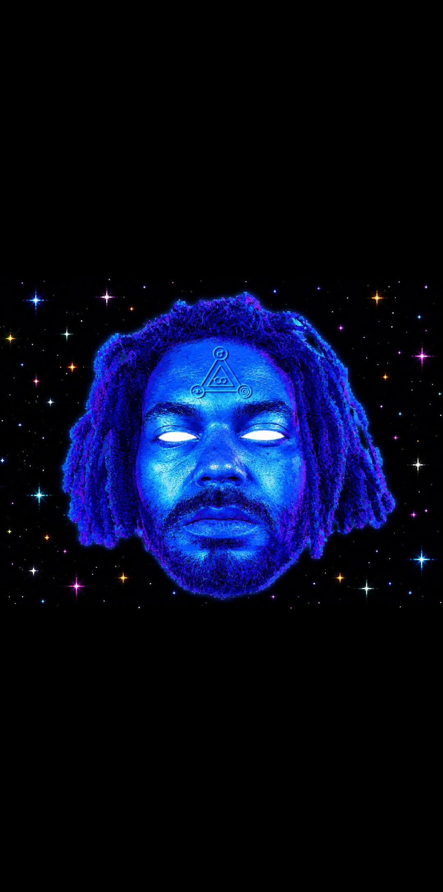

### SIGIL_ARTWORK

The Mars sigil as drawn: violet ringed triangle, orange Mars glyph, green eye, pink spiral, yellow molecule, teal edges.

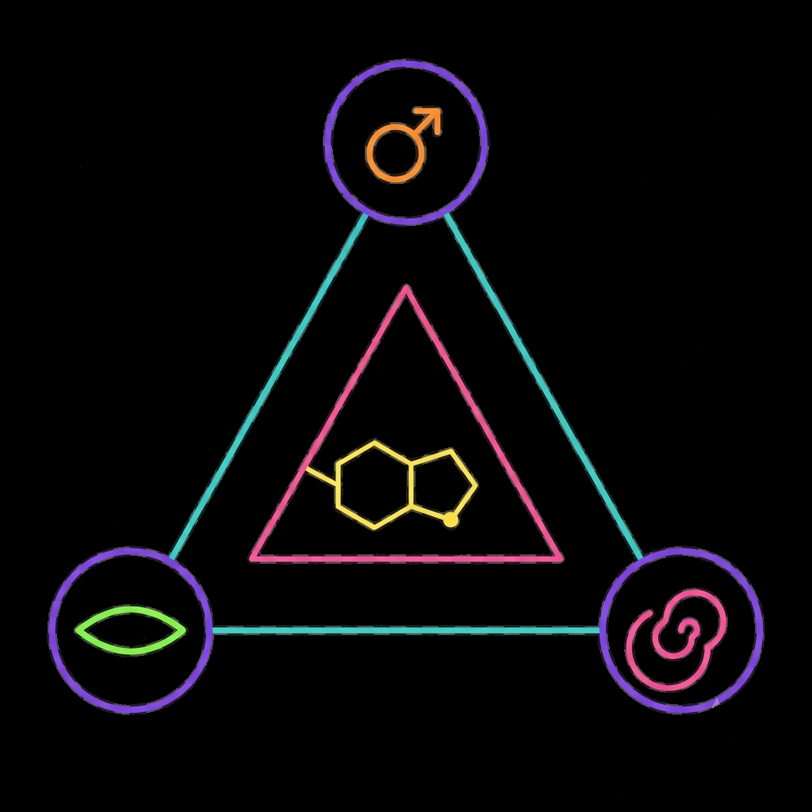

### SIGIL_KEYED_TRANSPARENT

The same sigil keyed to transparency, ready as a decal.

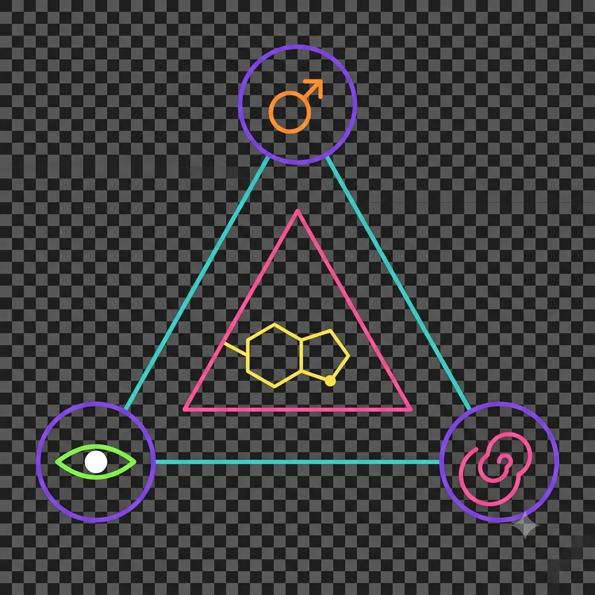

### SIGIL_ON_FOREHEAD_CORRECT

Sigil seated ON the forehead, neon, over a soft bokeh field.

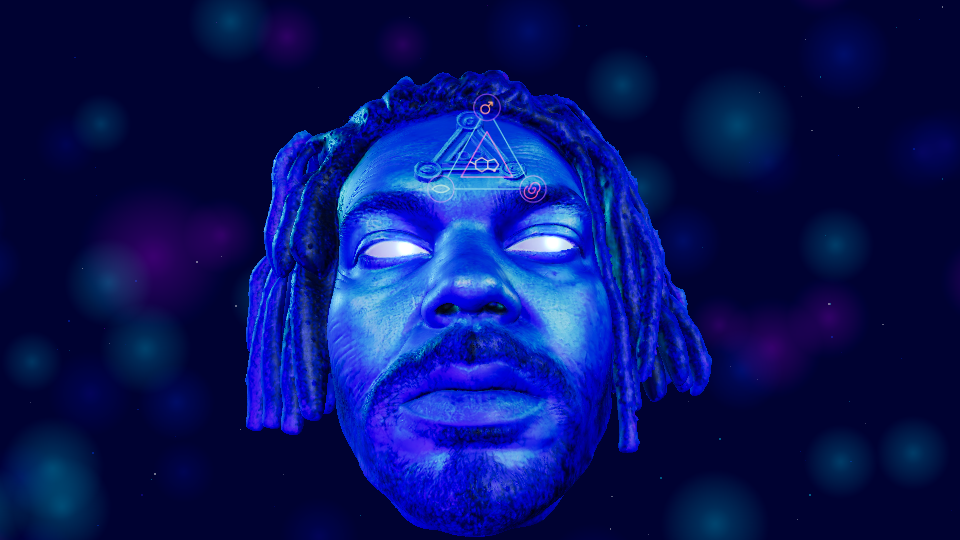

### SIGIL_MISPLACED_FLOATING

REJECTED: the decal floating beside the head instead of lying on the brow. Kept as the failure case.

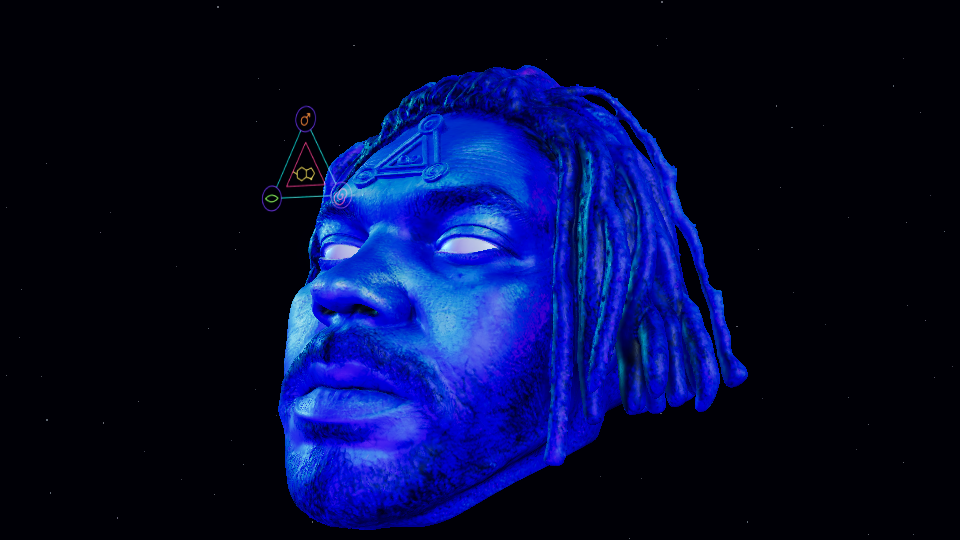

### ANIMATIC_SQUARES_REJECTED

REJECTED: hard square sprites instead of stars/nebula. The 'squares' problem.

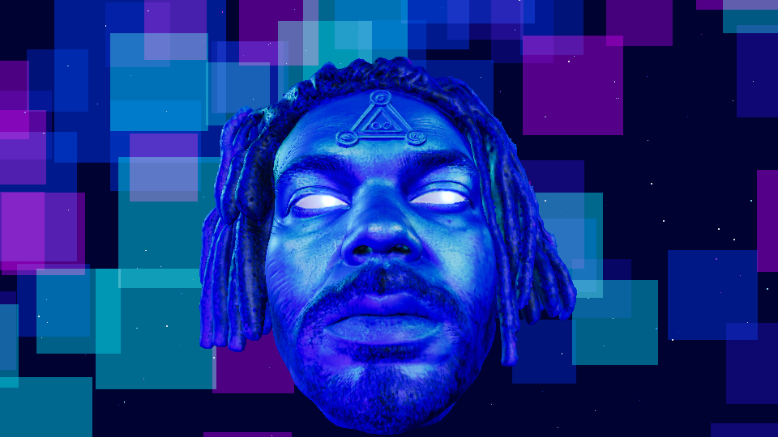

### ANIMATIC_SQUARES_WIDE

REJECTED: same squares, wide, with a wireframe icosahedron.

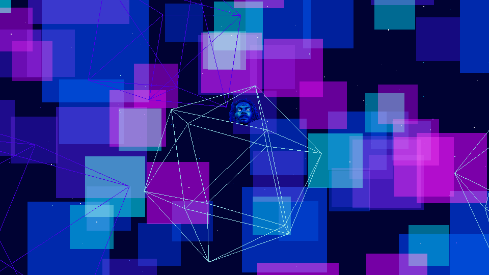

### ANIMATIC_PARTICLE_BAND

Dense particle band across squares -- closer to stars, still square-backed.

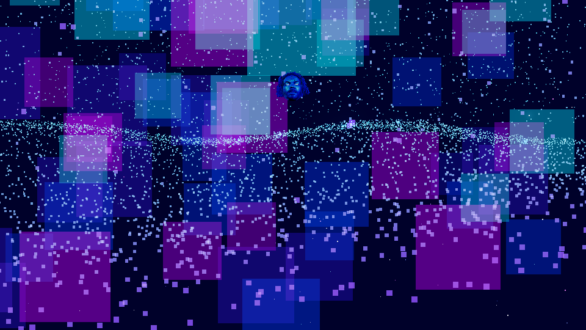

### ANIMATIC_HEAD_ON_BLACK_3Q

Mars three-quarter on a clean black starfield. Closest to canon of the animatic frames.

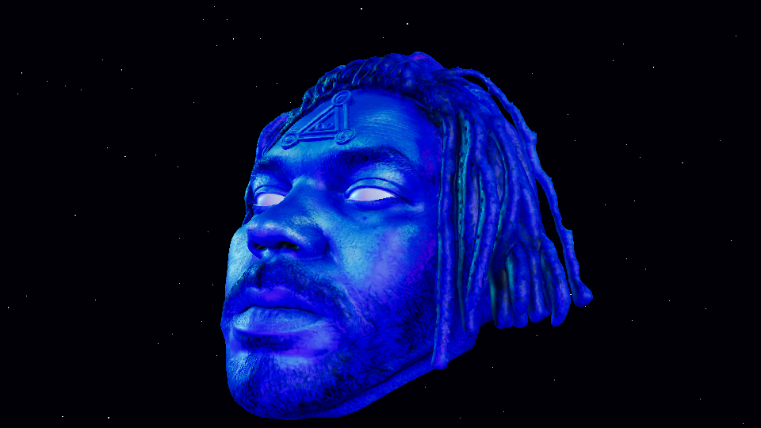

### ANIMATIC_HEAD_ON_BLACK_FRONT

Mars front on black with the sculpted brow sigil.

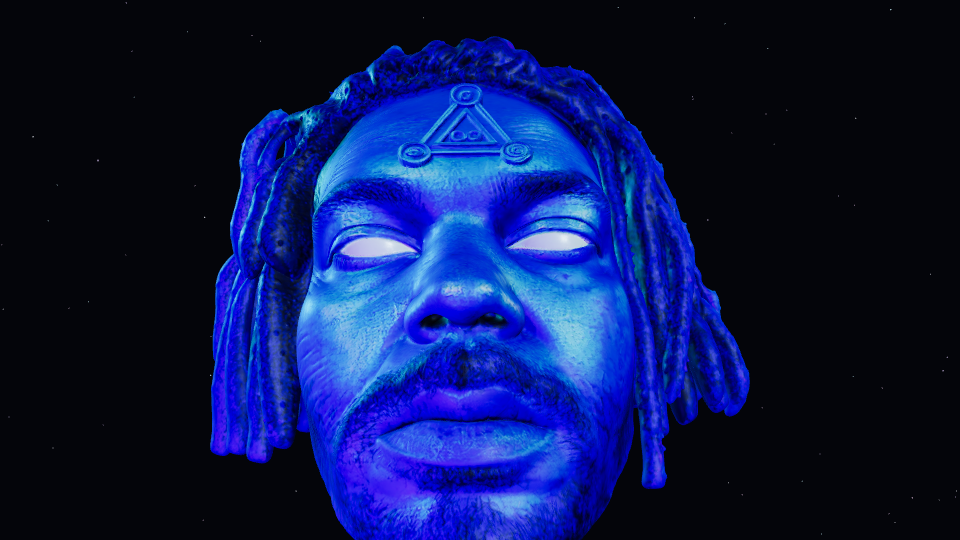

### COCKPIT_LOGIN

God Molecule control plane operator login.

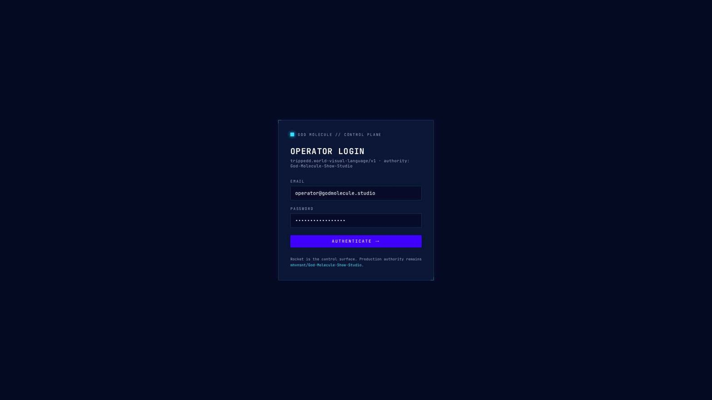

### COCKPIT_STARFIELD_BLOCKED

Cockpit with a run in BLOCKED / NO_BLENDER_WORKER_CONNECTED and QC_PENDING -- honest states, never a fabricated PASS.

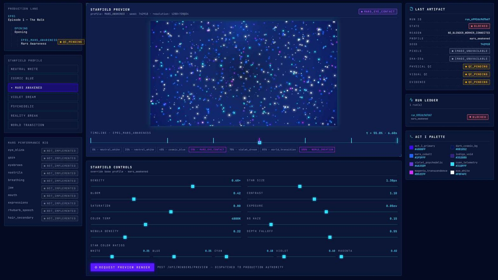

### COCKPIT_NO_RUN_DISPATCHED

Cockpit resting state: NO RUN DISPATCHED, empty run ledger.

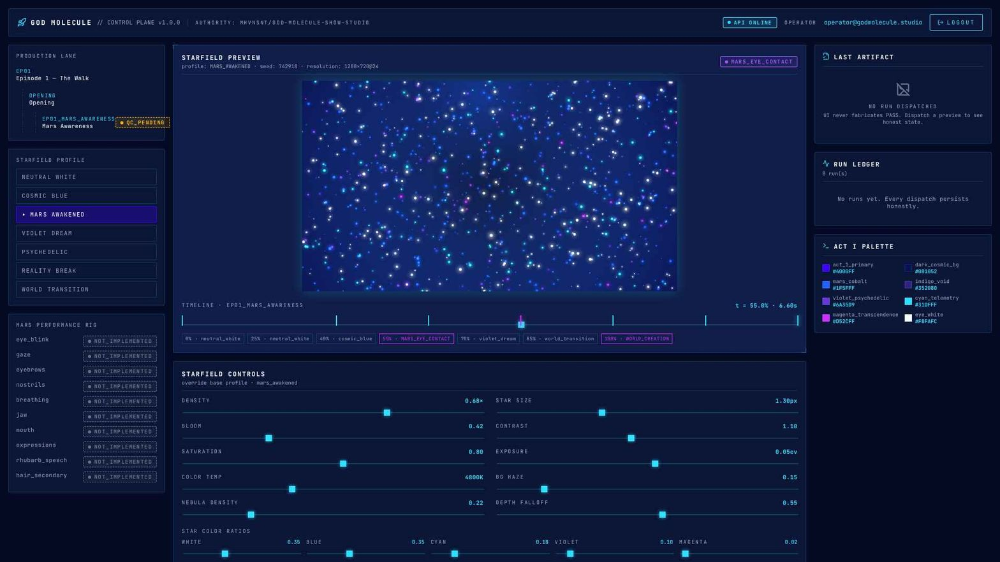

### MOUTH_BLOCKY_TEETH_REJECTED

REJECTED: procedural blocky crowns, the 'mouthguard' arch.

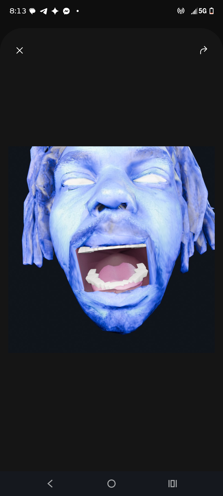

### MOUTH_GNM_DONOR

GNM scan-derived teeth, gums and tongue in place.

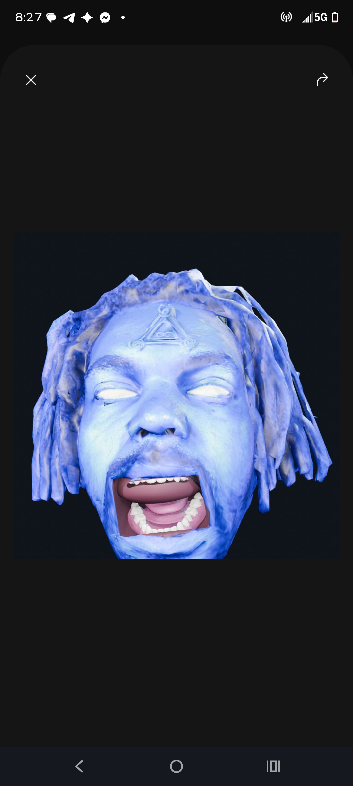

### MOUTH_WIDE_CURRENT

The WIDE pose as rendered in this session.

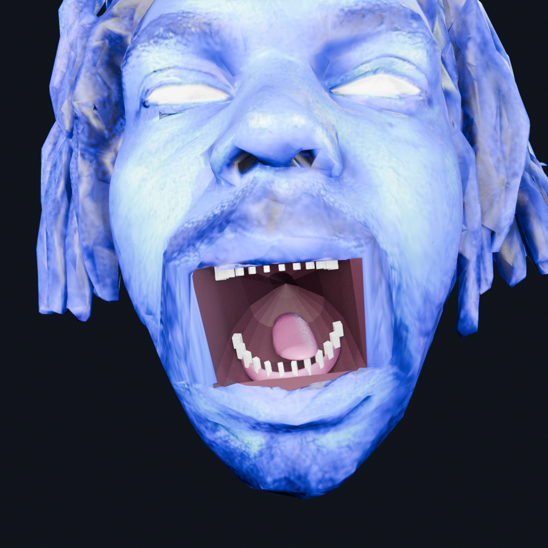

### SESSION_REST_FRAME

REST after the inverted-cutter fix, as reviewed on device.

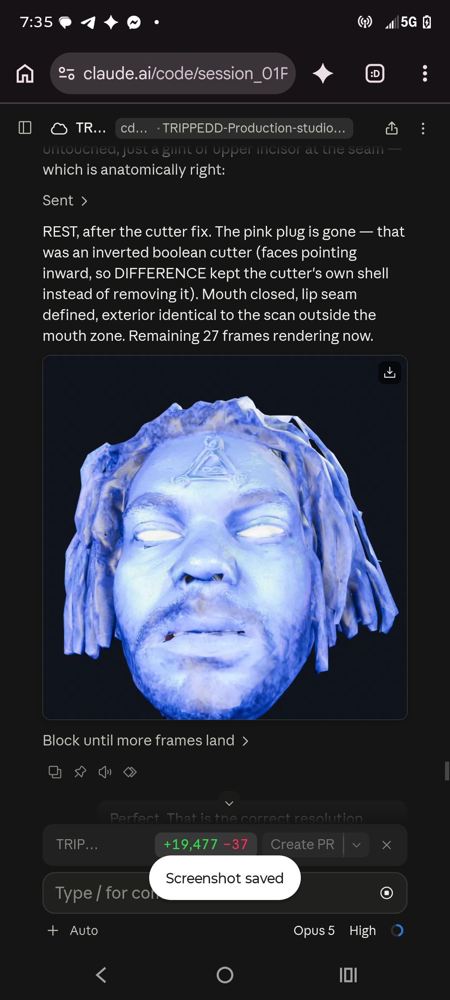

